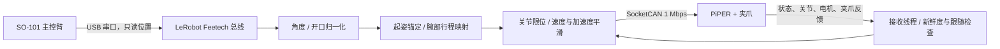

# SO-101 → PiPER 本机遥操

通过同一台 Linux 电脑，用 **SO-101 主控臂**直接遥操 **松灵 AgileX PiPER 六轴机械臂及夹爪**。SO-101 经 USB 串口读取，PiPER 经 USB-CAN / SocketCAN 控制；无需 ROS、网络中转、示教轨迹录制或学习策略。

这套代码来自实际设备调试：包含相对起姿接管、腕部剩余行程映射、夹爪绝对开口控制、速度/加速度平滑、模式准备、CAN 故障诊断，以及不连接硬件的回归测试。这里发布的是独立安装版，已去掉开发机器的路径、串口序列号和专用标定 ID。

**适用边界：**目前实机经验来自一台 PiPER（读回固件 S-V1.8-4）和原版 SO-101。不是任意机械臂通用驱动，不包含碰撞规划、力控制、相机录制或训练管线。首次移植须核对机械臂型号、固件协议和关节范围。偶发 `NO_ACK` 的物理原因仍未完全定位；本项目不会宣称短时测试等同于长期可靠性认证。

[English quick start](docs/README.en.md) · [协议与实现](docs/PROTOCOL.md) · [验证记录](docs/VALIDATION.md) · [许可证](LICENSE)

## 目录

- [功能与数据路径](#功能与数据路径)
- [硬件和软件准备](#硬件和软件准备)
- [安装](#安装)
- [SO-101 标定](#so-101-标定)
- [CAN 接口准备](#can-接口准备)
- [第一次启动](#第一次启动)
- [日常遥操命令](#日常遥操命令)
- [键盘操作](#键盘操作)
- [关节、腕部与夹爪映射](#关节腕部与夹爪映射)
- [完整参数](#完整参数)
- [停止条件与故障恢复](#停止条件与故障恢复)
- [故障排查](#故障排查)
- [开发与测试](#开发与测试)
- [开源范围与致谢](#开源范围与致谢)

## 功能与数据路径



| 能力 | 行为 |
| --- | --- |
| 本机直接遥操 | 默认 100 Hz 更新，MOVE J 模式 |
| 不同初始姿态 | 以接管时两臂实际姿态建立映射，不要求两边关节角相等 |
| 五轴到六轴 | 控制 PiPER J1/J2/J3/J5/J6，J4 保持接管时角度 |
| 腕部俯仰 | 使用已有 SO-101 标定，将两侧剩余行程分配给 J5 |
| 夹爪 | 主控 0–100% 开口 → PiPER 0–70 mm，默认开启 |
| 平滑 | 默认 60°/s、240°/s²；夹爪 50 mm/s |
| 暂停与重锚 | 空格暂停；C 以当前位置重新建立对应关系 |
| 预览与诊断 | CAN 零发送，查看输入、目标和反馈 |
| 模式准备 | 显式 `--prepare-can`，现场输入 ARM 后准备 CAN/MOVE J |
| 故障记录 | 保存原始 CAN 事件、各反馈年龄及接口计数变化 |

程序使用正常 CAN 控制模式，不进入示教录制。已测试设备在此模式下没有示教闪灯；**代码没有关闭灯光、隐藏故障灯或修改 LED 固件的指令**，也不承诺其他固件的灯光行为相同。

## 硬件和软件准备

- 一台 Linux 主机：本机实测内核 6.8，使用原生 SocketCAN。
- Python 3.10 或 3.12。纯桥接逻辑不需要 GPU；可选 LeRobot 依赖会安装其完整软件依赖，包括 PyTorch。
- 一套正确装配、已配置电机 ID 和波特率的 SO-101 **leader**，通过 USB 串口连接并正确供电。
- 一台兼容本项目 protocol v2 的 PiPER，正确供电、底座固定，夹爪及工作范围留有间隙。
- 支持 Linux SocketCAN 的 USB-CAN 转接器；实测为 `gs_usb` / candleLight。
- CAN 布线、终端电阻和接地按厂家要求配置，不能把 USB 串口当成 CAN 接口。
- 运行者在设备旁，能够操作实体急停。软件停止依赖仍可用的通信链路，不能替代硬件急停。

当前程序使用的 PiPER **命令角度范围**如下。这些值来自测试设备查询，不会写回固件；尤其不要假设所有 PiPER 的 J6 都是 ±180°。

| 关节 | 最小值 | 最大值 |
| --- | ---: | ---: |
| J1 | −150° | 150° |
| J2 | 0° | 180° |
| J3 | −170° | 0° |
| J4 | −100° | 100° |
| J5 | −70° | 70° |
| J6 | −180° | 180° |

其他设备范围不同，应先按厂家资料和查询结果适配 `bridge.py` 中的 `LIMITS` 并验证，不能扩大范围来掩盖装配、零点或协议问题。

## 安装

克隆本仓库并进入目录：

```bash
git clone https://github.com/ChenLing2345/so101-piper-teleop.git
cd so101-piper-teleop
```

Ubuntu/Debian 的基础依赖：

```bash
sudo apt-get update
sudo apt-get install -y python3-venv iproute2 psmisc can-utils
python3 -m venv .venv
source .venv/bin/activate
python -m pip install --upgrade pip
python -m pip install -e '.[leader]'
piper-teleop --help
```

`leader` extra 固定使用 PyPI 的 `lerobot[feetech]==0.4.3`，避免直接跟随上游主分支变化。该版本将 SO-101 实现放在 `so_leader` 模块；独立版也支持开发设备原有 checkout 中的 `so101_leader` 模块路径。

如果已有可用的 LeRobot/Feetech 环境，激活它后安装桥接本身即可：

```bash
python -m pip install -e .
piper-teleop --help
```

仅做 CAN 诊断或离线测试，不需要安装 `leader` extra。`pip install .` 只安装桥接代码；真正读取 SO-101 时仍需要 LeRobot 和 Feetech SDK。

三个等价入口：

```bash
piper-teleop --help
python -m piper_local --help
bash scripts/start_teleop.sh --help
```

脚本使用当前环境的 `python3`。需要指定解释器时可设置 `PIPER_PYTHON=/path/to/python`，不内置任何 Conda 路径。不要同时启动两个遥操进程。

## SO-101 标定

### 1. 确认串口

```bash
ls -l /dev/serial/by-id/
```

优先使用稳定的 `/dev/serial/by-id/...` 路径。以下示例假设当前 leader 是 `/dev/ttyACM0`，务必按自己的设备修改：

```bash
export PIPER_LEADER_PORT=/dev/ttyACM0
```

若提示串口无权限，按系统串口用户组配置访问权限。例如 Ubuntu 常使用 `dialout`；加入后需要重新登录：

```bash
sudo usermod -aG dialout "$USER"
```

无需用 root 运行整个 Python/LeRobot 环境。

### 2. 复用或生成标定

已有可用标定时，不要为了本项目重复标定。文件名应为 `<leader-id>.json`，设备 ID 通过 `--leader-id` 指定；默认 ID 为 `so101_leader`。

初次装配、尚未完成电机 ID/波特率设置时，先遵循 [LeRobot SO-101 官方装配与电机设置说明](https://huggingface.co/docs/lerobot/so101)。不要对已配置设备重复执行电机设置。

需要首次标定时，在完成正确装配后运行 LeRobot 的交互式标定：

```bash
lerobot-calibrate \
  --teleop.type=so101_leader \
  --teleop.port="$PIPER_LEADER_PORT" \
  --teleop.id=so101_leader
```

**此命令会写 SO-101 的标定，属于 LeRobot 配置过程，不是只读预览。** 按上游提示移动各关节并覆盖需要的行程。不要用别人的标定文件替代自己的测量。

桥接省略 `--calibration-dir` 时，由当前安装的 LeRobot 选择默认目录。PyPI 0.4.3 通常使用 `~/.cache/huggingface/lerobot/calibration/teleoperators/so_leader/`；较早 checkout 可能使用 `so101_leader/`，设置 HF 缓存环境变量后路径也可能改变。以标定命令实际打印的文件位置为准。

使用其他 ID 或迁移旧标定：

```bash
piper-teleop --seconds 10 \
  --leader-port "$PIPER_LEADER_PORT" \
  --leader-id my_leader \
  --calibration-dir /path/to/calibration/directory
```

程序从上述目录加载 `my_leader.json`，检查它与电机标定是否一致；本桥接不会自动重写标定或改变 leader 的力矩。若 leader 仍上力矩，会拒绝强行拖动，请先通过已知的正常配置流程释放力矩。

## CAN 接口准备

先查看接口，确认哪个 USB-CAN 属于 PiPER：

```bash
ip -details link show
```

以下假设接口为 `can0`，在没有控制程序运行时开启 1 Mbps 通信：

```bash
sudo ip link set can0 up type can bitrate 1000000
ip -details -statistics link show can0
```

这只配置主机 CAN 接口，不是机械臂复位、使能或回零。若接口已 UP 且速率正确，无需重复配置；速率需要修改时，先退出所有控制进程，再将接口 down 后重新配置。

独立检查 PiPER 反馈：

```bash
piper-teleop --diagnose-can --seconds 10
```

该模式不连接 SO-101、不发送查询或运动帧，不要求 ARM。`can_tx` 应为 0；`feedback_complete` 应为 true，并且各必要帧年龄应在 250 ms 内。`link_now` 和 `can_counter_delta` 用于区分当前错误与历史累计错误。

## 第一次启动

### 第一步：只读预览

```bash
piper-teleop --seconds 10 --leader-port "$PIPER_LEADER_PORT"
```

这是默认模式。缓慢操作 SO-101，检查 `leader` 是否变化、方向是否正确、腕部和夹爪输入是否覆盖预期范围。PiPER 不会因本进程而运动，结束时 `本进程CAN发送总数：0`。

预览中 `target_deg` 是计算目标，不代表目标已经发送；`actual_deg` 才是受控臂反馈。

### 第二步：准备 PiPER 模式

```bash
piper-teleop --prepare-can
```

这个模式只需要 CAN，不需要连接 leader。若已经处于健康 CAN/MOVE J、六关节均使能，会零发送退出。否则现场输入 **ARM** 后，按厂家示例流程停止、复位、等待恢复、预装当前位置的合法目标，再使能六关节。

**复位会短暂卸力，必须托稳。** 本步骤不操作夹爪、不自动回零、不规划从桌面或支撑物上抬起的路径。厂家复位条件只约束承重相关的 J2/J3/J5：支持近零姿态，或 `|J2|、|J3|<约10°` 且 `12°<J5<45°` 的示例支撑姿态；J1/J4/J6 不要求归零。此条件不用于限制已正常就绪的遥操。

六关节实测值轻微越过命令边界时，保持目标会投影到合法范围，目标与实测的最大偏差不得超过 5°；测量值本身不被改写。不要通过扩大限位跳过异常零点。

### 第三步：短时实控

确认运动范围和夹爪间隙后，进行首次低速、短时实控：

```bash
piper-teleop --live --seconds 10 \
  --leader-port "$PIPER_LEADER_PORT" \
  --speed 15 --accel 60
```

现场输入 **ARM** 才开始。先小幅操作单个关节，核对方向，再操作夹爪。程序不接受通过管道输入 ARM。到时会停止；下一次实控前如模式已变为停止态，重新运行 `--prepare-can`。

## 日常遥操命令

设备、方向和活动空间验证完成后，可使用当前调试好的默认参数：

```bash
piper-teleop --prepare-can &&
piper-teleop --live --seconds 0 \
  --leader-port "$PIPER_LEADER_PORT" \
  --leader-id so101_leader \
  --control-mode joint \
  --gain 1 --signs=-1,1,1,1,1 \
  --speed 60 --accel 240 --hz 100 --can-speed 100 \
  --max-offset 0 --wrist-mapping range \
  --gripper --gripper-speed 50 --gripper-effort 0.5
```

`--seconds 0` 持续运行，直到 Q、Ctrl+C 或异常停止。使用 `&&` 确保准备失败时不会继续启动下一条命令。非 ARM 的准备输入会取消准备；即使随后调用 LIVE，也必须重新通过状态检查和独立的 ARM 提示才会运动。

上述大部分参数就是默认值，因此也可以简写：

```bash
piper-teleop --prepare-can &&
piper-teleop --live --seconds 0 --leader-port "$PIPER_LEADER_PORT"
```

要保留完整终端日志：

```bash
mkdir -p logs
set -o pipefail
piper-teleop --live --seconds 0 --leader-port "$PIPER_LEADER_PORT" 2>&1 | tee logs/teleop.log
```

标准输入仍是现场终端；不要给它接入自动回复 ARM 的输入管道。共享日志前检查串口路径等本机信息。

## 键盘操作

| 按键 | 效果 |
| --- | --- |
| 空格 | 暂停跟随，保持当前反馈位置；不是机械断电 |
| C / c | 读取两臂新鲜姿态，重新锚定关节映射并恢复跟随 |
| Q / q | 发送停止并退出 |
| Ctrl+C | 清理并停止后退出 |

暂停时程序仍读取 leader 和 PiPER、执行反馈检查、发送保持目标。C 不重新定义夹爪的全开/全闭含义。退出时若有新鲜、健康的夹爪反馈，先发送当前实际开口作为保持目标，再发送机械臂快速停止；不会主动张开松掉物体。通信完全失效时，软件无法保证停止帧送达。

## 关节、腕部与夹爪映射

### 关节对应关系

| SO-101 轴 | PiPER | 默认方向 | 映射 |
| --- | --- | ---: | --- |
| shoulder_pan | J1 | −1 | 相对角度增量 |
| shoulder_lift | J2 | +1 | 相对角度增量 |
| elbow_flex | J3 | +1 | 相对角度增量 |
| wrist_flex | J5 | +1 | 标定剩余行程映射 |
| wrist_roll | J6 | +1 | 相对角度增量，处理 ±180°跨界 |
| gripper | 夹爪 | 固定开口语义 | 0–100% → 0–70 mm |
| 无对应输入 | J4 | — | 保持接管角度 |

SO-101 五个旋转自由度不能完整控制 PiPER 的六个旋转自由度。J4 固定会影响腕部在空间中的弯折平面。两臂连杆长度、底座高度和 TCP 不同，关节遥操不保证指尖绝对位置、离桌高度或姿态一致。

### 为什么不要求两臂初始角度相同

对 J1/J2/J3/J6，目标为：

```text
PiPER目标 = PiPER接管角 + gain × sign × SO-101从接管时起的角度变化
```

首次目标保持 PiPER 当前姿态，再随手动输入变化；不会直接把 SO-101 的绝对读数发给 PiPER。C 可在任意合适姿态重新建立这种对应关系。

`--max-offset 0` 表示取消额外的相对行程截断，仍保留真实关节限位。旧版 ±90°限制曾导致主控臂已下探而受控臂仍高于目标。确实需要缩小运动范围时，可显式设为正数，例如 `--max-offset 30`。

### 腕部上下弯折为什么使用 range

SO-101 腕部标定行程与 PiPER J5 行程不同。直接复制角度增量再叠加起姿差，会让一侧过早碰到限位，手腕回转一段后受控端仍不动。

默认 `range` 以接管时的两臂腕角为对应点：将 SO-101 从当前点到下端点的剩余行程，对应到 PiPER 当前 J5 到 −70°；另一侧对应到 +70°。两侧分别线性映射，再经过增益、限位和速度/加速度平滑。端点来自各自设备标定与关节范围，不写入新的电机零点。

`--wrist-mapping relative` 恢复普通角度增量模式，可用于比较。重锚时两侧比例会重新计算；靠近端点重锚时，一侧可能更灵敏，需要小幅试动。

### 夹爪为什么使用绝对开口

夹爪的动作表达“开多少”，所以主控开口 0% 对应 0 mm，100% 对应 `--gripper-open-mm`，默认 70 mm。进入实控时从当前实际开口限速过渡，不会瞬间跳到另一开口。

- `--gripper` 默认开启；`--no-gripper` 完全不发送夹爪命令。
- `--gripper-speed 50` 是目标变化速度上限，单位 mm/s。
- `--gripper-effort 0.5` 是协议中的力矩参数，单位 N·m；不代表标定后的指尖夹持力。
- `--gripper-open-mm 40` 可缩小全开目标。
- 抓住物体后无法达到闭合目标是正常接触，不用固定开口误差让整臂误停；实际夹爪故障、失能或反馈超时仍会停止。

## 完整参数

所有角度参数均为度，角速度为度/秒；编码成 CAN 时换算为协议单位。不要把弧度值直接填入这些参数。

| 参数 | 默认值 | 说明 |
| --- | --- | --- |
| 无运行模式参数 | PREVIEW | CAN 零发送预览 |
| `--live` | 关闭 | 实控，现场 ARM |
| `--prepare-can` | 关闭 | 显式模式准备，可能复位卸力 |
| `--diagnose-can` | 关闭 | 独立 CAN 零发送检查 |
| `--can` | `can0` | SocketCAN 接口 |
| `--leader-port` | 环境变量 `PIPER_LEADER_PORT` 或 `/dev/ttyACM0` | SO-101 串口 |
| `--leader-id` | `so101_leader` | 标定文件名中的设备 ID |
| `--calibration-dir` | LeRobot 默认目录 | 包含该 ID 的 JSON 的目录 |
| `--seconds` | 10 | 0 表示持续运行；诊断必须大于 0 |
| `--gain` | 1 | 旋转映射增益，(0, 1] |
| `--signs` | `-1,1,1,1,1` | 顺序为 J1/J2/J3/J5/J6；每项 ±1 |
| `--speed` | 60 | 各关节目标速度上限，(0, 120] °/s |
| `--accel` | 240 | 目标加速度上限，(0, 720] °/s² |
| `--hz` | 100 | 控制循环频率，10–200 Hz |
| `--control-mode` | `joint` | `joint` 或 `servo`；servo 是厂家 JS 模式 |
| `--can-speed` | 100 | MOVE J 速度比例，1–100% |
| `--max-offset` | 0 | 0 不加相对行程限制；正数最多 180° |
| `--wrist-mapping` | `range` | `range` 或 `relative` |
| `--gripper` / `--no-gripper` | 开启 | 是否控制夹爪 |
| `--gripper-speed` | 50 | (0, 100] mm/s |
| `--gripper-open-mm` | 70 | (0, 70] mm |
| `--gripper-effort` | 0.5 | (0, 5] N·m |

以负号开头的方向参数使用等号：`--signs=-1,1,1,1,1`。三种显式运行模式互斥。默认 `joint` 来自实际对比；`servo` 名称不意味着对当前设备一定更快，详见验证记录。

## 停止条件与故障恢复

接收线程独立检查反馈和控制更新。主要停止条件包括：

- 必要反馈超过 250 ms 未更新，或主控读取/控制循环超过 250 ms 未更新。
- PiPER/电机/夹爪报告真实故障或失能，或控制模式在运行中变化。
- 检测到其他控制端发送相关控制帧，避免争抢同一机械臂。
- 非有限数、主控旋转轴单帧跳变超过 45°、发送失败。
- 持续跟随偏差超过已发送目标历史允许范围。
- CAN `NO_ACK`、溢出、warning/passive、bus-off、协议错误等真实异常。

跟随误差并非“任意一帧超过 5°立即停止”。程序比较最近 250 ms **确实发出的目标**范围，允许 5°静态容差，并限制当前目标领先量不超过 `5° + speed × 0.25 s`。这样容许正常伺服滞后，同时仍能发现持续卡住或严重偏离。这不是碰撞检测。

异常后先尝试停止，再记录：

```text
~/.local/state/so101-piper-teleop/failures/failure-<timestamp>.json
```

若设置 `XDG_STATE_HOME`，则使用其下的 `so101-piper-teleop/failures/`。日志包含原始错误、接口前后信息、错误计数增量、各反馈年龄和近期 CAN 事件；终端打印实际路径。运行时不会自动清故障、重开 CAN 或恢复旧运动目标。

## 故障排查

| 现象 | 先看什么 | 处理 |
| --- | --- | --- |
| 全部反馈缺失、发送 0 | `--diagnose-can`、电源、USB-CAN 和 CAN 接线 | 先恢复通信；此时尚未发送运动指令，不是起姿映射问题 |
| 部分帧超时 | `required_frame_age_ms`、错误增量 | 区分某组反馈停止与整条链路掉线；不要直接加大超时 |
| `NO_ACK` | 原始事件及供电/线缆/节点状态 | 表示发送未获确认；排查链路后重新准备，不能当作恢复通知忽略 |
| `ERROR-WARNING` 但仍有新鲜反馈 | 当前事件、计数增量 | 历史状态/累计值不等于当下持续故障；结合实时证据判断 |
| 全零或尾部 `5f00` 的 `0x20000004` | 驱动是否 `gs_usb`、完整载荷 | 本项目已处理已知的 ERROR-ACTIVE 通知，不因此误停 |
| 标定不存在 | `--leader-id`、标定目录、LeRobot 版本 | 复用实际标定路径或先完成自己的标定 |
| 标定与电机不一致 | LeRobot 标定文件及设备 | 不自动覆写电机；按配置流程核对 |
| leader 仍有力矩 | SO-101 当前配置 | 先释放主控臂力矩，不要强行拖动 |
| 实控需要 CAN/MOVE J | `mode` / `move_mode` / `teach` | 结束机身正在进行的示教，再 `--prepare-can` |
| 无法满足复位支撑姿态 | J2/J3/J5 与实际支撑 | 托稳并按厂家准备姿态操作，不要求两臂绝对角相同 |
| 启动保持差超过 5° | 实测、合法目标、零点 | 核对设备和零点；不能通过放大限位掩盖异常 |
| 手动方向相反 | `joint_signs` 和轴对应表 | 停机后修改对应 sign，再从小幅试动开始 |
| 反应慢 | `desired_deg`、`target_deg`、`actual_deg` | 期望到目标是软件限速；目标到实测是设备跟随；不要混在一起 |
| 下探仍够不到 | `offset_limited_joints` / `joint_limited_joints` | 确认 `--max-offset 0`；真实设备限位和不同几何结构仍存在 |
| 腕部回转不灵敏 | 腕标定、起姿和 `--wrist-mapping` | 默认 range；重锚会改变两侧比例 |
| 夹爪不动 | `gripper_control`、输入百分比、目标/实际 mm、故障 | 确认没有 `--no-gripper`、输入覆盖行程、未夹住物体 |
| 程序恰好 10 秒停止 | `--seconds` | 默认测试时长 10 秒；长期用 0 |

gs_usb 特例只接受纯 `0x20000004`、前六字节零、末两字节均低于 96 的已知格式；混入 ACK、协议错误、警告或非零保留字段不会放行。恢复通知不能清除先前锁定的真实故障。协议解释见 [PROTOCOL.md](docs/PROTOCOL.md)。

仅在退出全部控制进程、托稳机械臂后，若接口 DOWN/BUS-OFF 或持续无反馈，可检查实体连接并按需要手工重开接口：

```bash
sudo ip link set can0 down
sudo ip link set can0 up type can bitrate 1000000
piper-teleop --diagnose-can --seconds 10
```

不需要每次启动都重开接口。重开 CAN 不会自动准备机械臂；通信恢复后再运行日常命令。不要在正在遥操时按机身示教按钮切换控制方式。

## 开发与测试

```bash
python -m pip install -e '.[test]'
python -m pytest -q
python -m build
```

测试使用模拟反馈、Unix socket pair 和假总线，不打开 USB/CAN，不驱动真实设备。GitHub Actions 执行 Python 3.10/3.12 的离线测试、CLI 帮助检查和打包。

```text
src/piper_local/bridge.py    映射、CAN 编码/解码、线程、CLI
src/piper_local/__main__.py  python -m 入口
scripts/start_teleop.sh      源码目录启动入口
tests/test_bridge.py        原实机调试形成的离线回归测试
tests/test_packaging.py     独立发布版入口与配置测试
docs/PROTOCOL.md            帧、单位、模式及线程流程
docs/VALIDATION.md          实测范围、证据摘要和已知限制
docs/README.en.md           English quick start
```

修改运动逻辑应先增加能复现问题的离线用例，再按明确的现场流程实测。报告问题时附上命令、设备/固件版本、第一条错误和脱敏后的故障记录，并区分“日志数值变化”和“现场确实看到动作”。

## 开源范围与致谢

按 Apache-2.0 发布，见 [LICENSE](LICENSE) 和 [NOTICE](NOTICE)。包含完整桥接、启动脚本、测试与文档；不附带开发机器的标定、设备序列号、令牌、原始操作日志、照片、训练数据或无关项目代码。

本项目依赖 [LeRobot](https://github.com/huggingface/lerobot) 的 SO-101/Feetech 实现，参考 [AgileX piper_sdk](https://github.com/agilexrobotics/piper_sdk)、[Agilex-College](https://github.com/agilexrobotics/Agilex-College)、Linux SocketCAN 与 candleLight 固件。各上游项目保留其许可证与商标；这是独立集成项目，不是厂家官方发行版。
